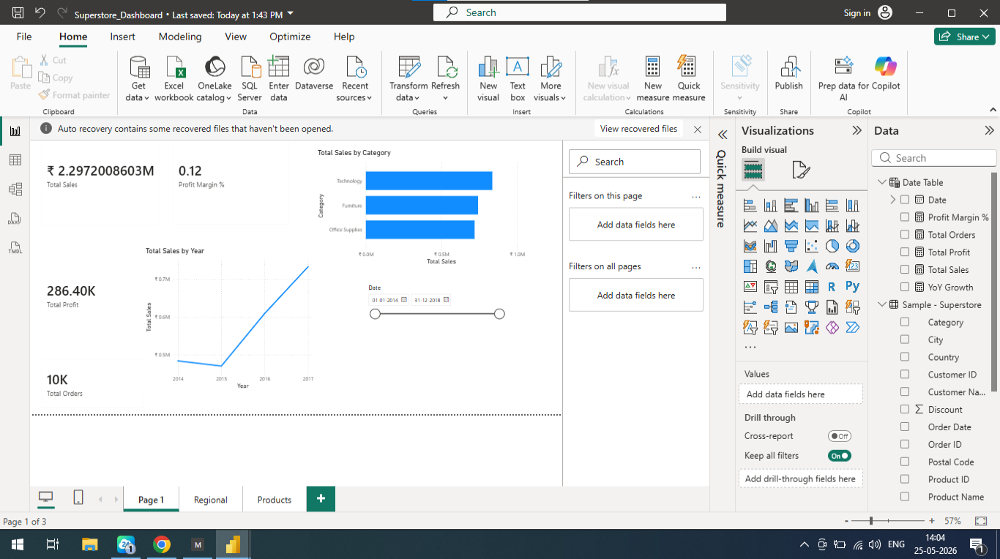
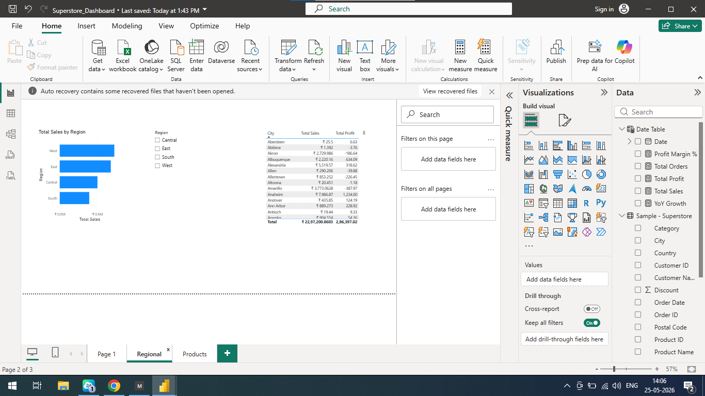
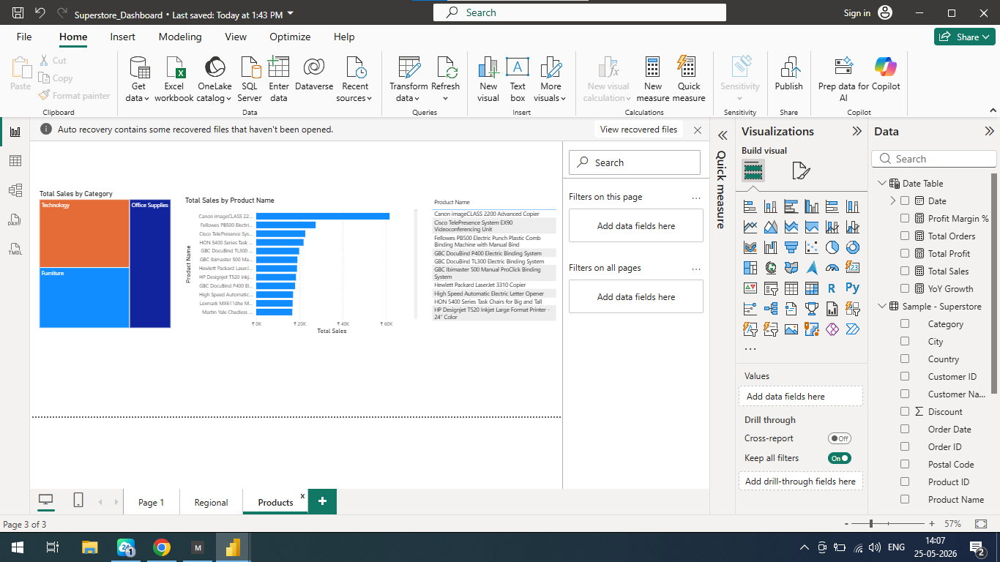

# 📊 Superstore Sales Dashboard - Power BI

## 📌 Objective
Analyze sales trends across regions, categories and products.

## 🗂️ Dataset
Source: Superstore Sales Dataset

## 🛠️ Tools Used
- Power BI Desktop
- Power Query
- DAX

## 📈 Key Insights
- Technology is the highest selling category
- West region leads in total sales
- Canon imageCLASS is the top selling product

## 📸 Dashboard Preview

